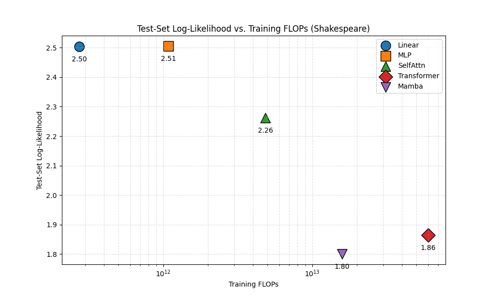
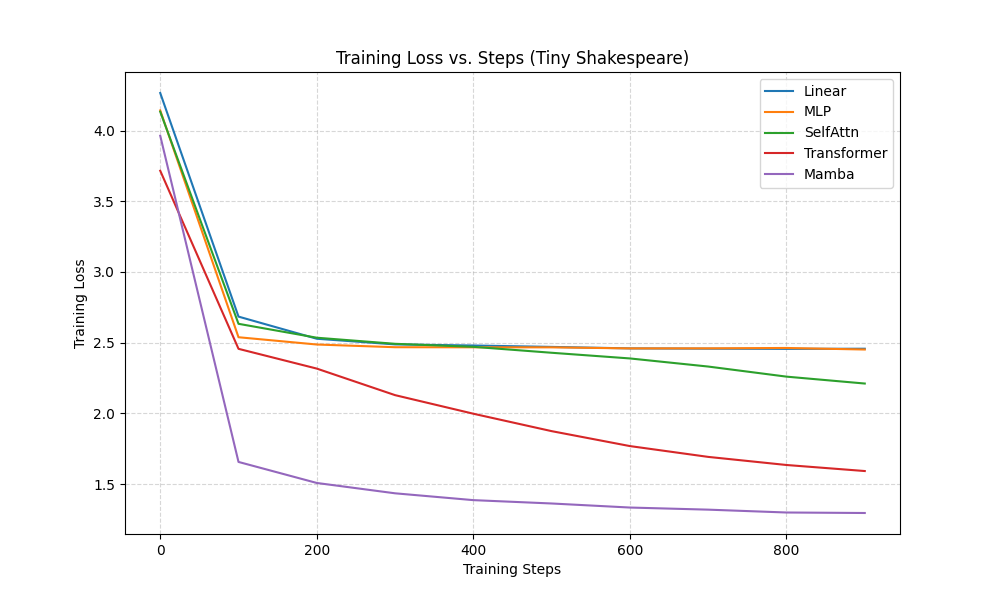

# Scalable Sequence Modeling: Mamba vs. Transformers

[](https://www.python.org/)
[](https://pytorch.org/)
[]()

## 🚀 Project Overview
This project performs a rigorous comparative analysis of **Selective State Space Models (Mamba)** against **Transformers** and linear baselines. The primary objective was to investigate the trade-offs between modeling capability and computational complexity, specifically addressing the $\mathcal{O}(L^2)$ bottleneck of Global Self-Attention in long-sequence modeling.

Experiments were conducted on **Tiny Shakespeare** (character-level) and **WikiText-2/PTB** (word-level) to evaluate training convergence, inference throughput, and generalization capabilities.

## 📊 Key Results
The **Mamba** architecture demonstrated superior data efficiency and scaling properties compared to the Transformer baseline, achieving lower test loss with linear complexity.

| Model | Params / Config | Test Loss (Lower is Better) | Complexity | Inference Memory |
|-------|----------------|-----------------------------|------------|------------------|
| **Mamba** | State Dim: 16 | **1.8006** | $\mathcal{O}(L)$ (Linear) | Fixed $\mathcal{O}(d)$ |
| **Transformer** | Layers: 6 | 1.8640 | $\mathcal{O}(L^2)$ (Quadratic) | Growing $\mathcal{O}(L)$ |
| Self-Attention | Heads: 4 | 2.2619 | $\mathcal{O}(L^2)$ | Growing $\mathcal{O}(L)$ |
| Linear Baseline | Context: 128 | 2.5040 | $\mathcal{O}(1)$ | Fixed |

### Critical Findings
* **Efficiency:** Mamba achieved the lowest validation loss (1.8006) while maintaining **linear $\mathcal{O}(L)$ training complexity** and **constant $\mathcal{O}(1)$ inference time**.
* **Compute-to-Performance Ratio:** Analysis of Test-Set Log-Likelihood vs. Training FLOPs revealed that Mamba converges faster and reaches a lower loss ceiling than Transformers for the same computational budget.
* **Generalization:** On word-level tasks (WikiText-2), Mamba consistently converged to a lower training loss than the Transformer.

## 📈 Visualizations

### 1. Efficiency Analysis
**Mamba achieves lower loss with fewer FLOPs compared to Transformers.**


### 2. Training Convergence
**Mamba (Purple) and Transformer (Red) show rapid feature learning compared to baselines.**


## 🧠 Architecture Analysis

### The Transformer Bottleneck
Transformers rely on Global Self-Attention, computing pairwise interactions between all tokens ($Q, K, V$).
$$\text{Attention}(Q, K, V) = \text{softmax}\left(\frac{QK^T}{\sqrt{d_k}}\right)V$$
While this provides perfect history recall, it incurs an **$\mathcal{O}(L^2)$** cost and requires a growing KV cache during inference, preventing constant-time generation.

### The Mamba Advantage
Mamba utilizes a Selective State Space Model (SSM) to compress context into a fixed-size latent state $h_t$. The parameters are functions of the input (Selectivity), allowing the model to filter noise and retain relevant context:
$$h_t = \overline{\mathbf{A}}h_{t-1} + \overline{\mathbf{B}}x_t$$
This design decouples inference latency from sequence length, enabling high-throughput generation ideal for resource-constrained systems.

## 💻 How to Run

### 1. Clone the Repository
```bash
git clone [https://github.com/YOUR_USERNAME/scalable-sequence-modeling.git](https://github.com/YOUR_USERNAME/scalable-sequence-modeling.git)
cd scalable-sequence-modeling
```

### 2. Install Dependencies
it is recommended to use a virtual environment.
```bash
# create and activate virtual environment
python -m venv venv
source venv/bin/activate  # On Windows use: venv\Scripts\activate

# install PyTorch (visit pytorch.org for command specific to your OS/CUDA version)
pip install torch --index-url [https://download.pytorch.org/whl/cu118](https://download.pytorch.org/whl/cu118)  # Example for CUDA 11.8

# install remaining requirements
pip install -r requirements.txt
```

### 3. Run the Experiments
The core logic and training loops are contained within the Jupyter Notebook.
```bash
jupyter notebook code/scalable-sequence-modeling.ipynb
```

## 📂 Project Structure
```text
scalable-sequence-modeling/
├── code/
│   └── scalable-sequence-modeling.ipynb   # Complete implementation from scratch
├── datasets/
│   ├── tiny_shakespeare/                  # Character-level dataset
│   ├── wikitext-2/                        # Word-level benchmark
│   └── ptb/                               # Penn Treebank benchmark
├── plots/                                 # Generated analysis figures
├── README.md
└── requirements.txt
```

---
*This project was developed as part of the CS689 Machine Learning course at UMass Amherst.*
